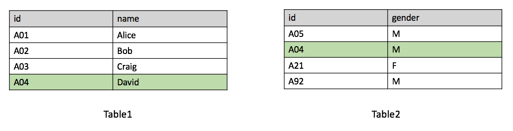
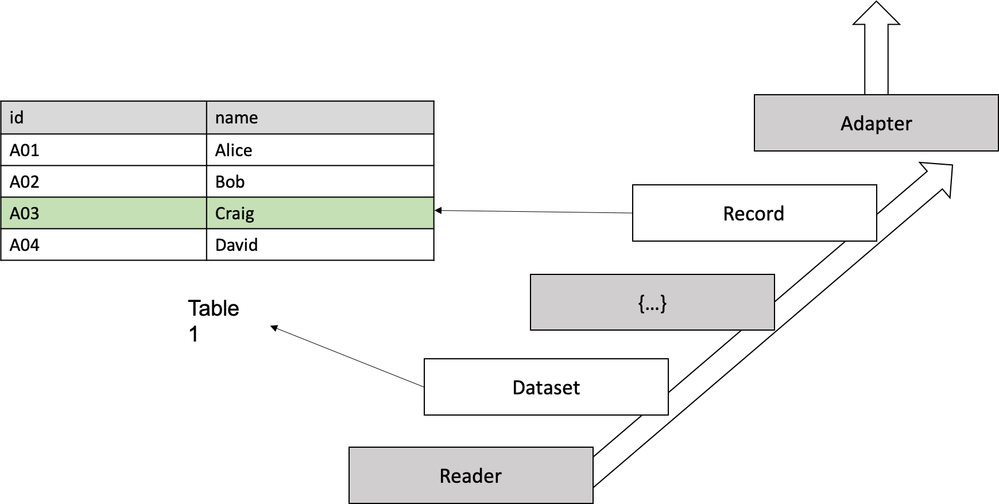
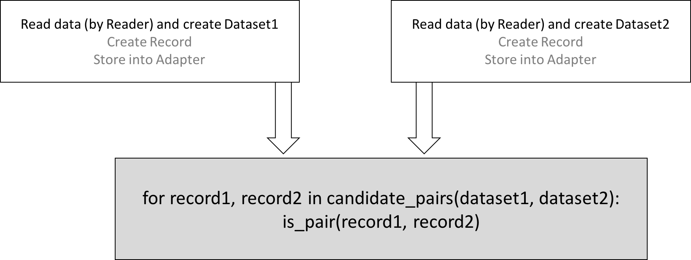
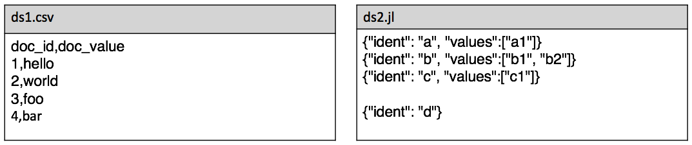
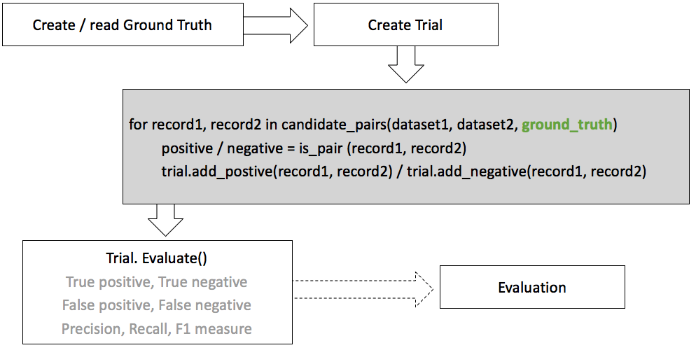
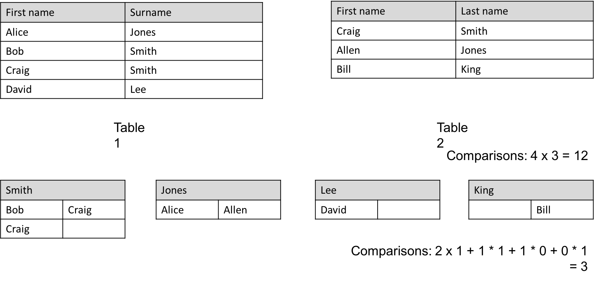
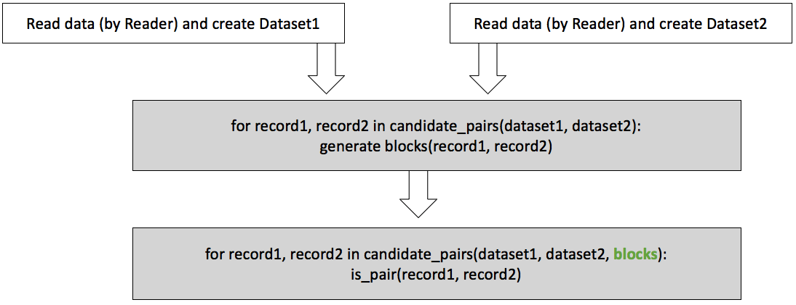

Overview
=================

What's Record Linkage
---------------------

Record linkage (RL) is the task of finding records in a data set that refer to the same entity across different data sources (e.g., data files, books, websites, and databases). -- Wikipedia

Assume we have two following tables:

It's obvious that both of them have identical *id* ``A04`` and these two belong to the same entity. Then we know that "David's id is A04 and he is a male".

But real world situations are more complex:

* Typos: “Joh” vs “John”
* OCR errors: “J0hn” vs “John”
* Formatting conventions: “03/17” vs “March 17”
* Abbreviations: “J. K. Rowling” vs “Joanne Rowling”
* Nick names: “John” vs “Jock”
* Word order: “Sargent, John S.” vs “John S. Sargent”

Record Linkage Toolkit (RLTK) is designed to give a easy to use, scalable and extensible way of resolving these problems.

Basic Components & Data Flow
----------------------------

The first step of using RLTK is to create ``Dataset``.

In RLTK, every "row" in table is called ``Record``. Notice "row" here is a logical concept: for a csv file it's a csv object (can be formed by multiple lines); for a json lines file, it's a line object; for a query from DBMS, it's one row; for some self-defined stream, it's a minimal entity.

``Dataset`` is a "table", or more precise, a collection of ``Record`` s.

``Reader`` is used to handle heterogeneous input. For each "row", the return of the ``Reader`` is represented in a Python dictionary, named ``raw_object`` (shown as grey ``{...}`` in figure). ``Record`` is generated based on ``raw_object``: user need to extend base ``Record`` class and add properties for later usage.

``KeyValueAdapter`` is where all ``Record`` s get stored. It can be either in memory or persistent.

So, the data flow is: in order to create ``Dataset``, use ``Reader`` to read from input source and convert entity by entity to ``raw_object`` which is used to construct ``Record``, then store ``Record`` in ``KeyValueAdapter``.

Obviously, generating ``Record`` is really time consuming if the dataset is large, but if the concrete ``KeyValueAdapter`` is a persistent one (e.g., ``HBaseKeyValueAdapter``), then next time, ``Dataset`` can be loaded directly from this ``KeyValueAdapter`` instead of regenerating again from raw input.

Minimal Workflow & Implementation
---------------------------------

Now we have two ``Datasets`` and we need to find pairs (If it's de-duplication problem, only one ``Dataset`` is needed).

Simply using RLTK's API to get all possible combinations of candidate pairs and implement your only "magical function" (shown as ``is_pair()`` in figure) to find if two ``Record`` s are the same.

Let's look at example input datasets and minimal implementation.

.. code-block:: python

   import rltk

   class Record1(rltk.Record):
      @property
      def id(self):
         return self.raw_object['doc_id']

      @property
      def value(self):
         return self.raw_object['doc_value']

   class Record2(rltk.Record):
      @rltk.cached_property
      def id(self):
         return self.raw_object['ident']

      @rltk.cached_property
      def value(self):
         v = self.raw_object.get('values', list())
         return v[0] if len(v) > 0 else 'empty'

   ds1 = rltk.Dataset(reader=rltk.CSVReader('ds1.csv'),
                        record_class=Record1, adapter=rltk.MemoryKeyValueAdapter())
   ds2 = rltk.Dataset(reader=rltk.JsonLinesReader('ds2.jl'),
                        record_class=Record2, adapter=rltk.DbmKeyValueAdapter('file_index'))

   pairs = rltk.get_record_pairs(ds1, ds2)
   for r1, r2 in pairs:
      print('-------------')
      print(r1.id, r1.value, '\t', r2.id, r2.value)
      print('levenshtein_distance:', rltk.levenshtein_distance(r1.value, r2.value))
      print('levenshtein_similarity:', rltk.levenshtein_similarity(r1.value, r2.value))

One thing to notice here: the property in ``Record`` class can be decorated by ``@property``, or ``@rltk.cached_property`` which pre-calculates the value instead of computing at the runtime.

For the "magical function", you can use any methods that make sense: hand-crafted rules, machine learning model, etc. RLTK provides a lot of similarity metrics which can be very helpful while doing comparison.

Evaluation
----------

After designing the "magical function", you need a way to judge its performance. RLTK has a built-in package called ``Evaluation`` which includes three basic components:

* Groud Truth: Ground truth data.
* Trial: Store the result of prediction of candidate pairs.
* Evaluation: Visualize the result of evaluation if multiple trials are given.

As can be seen from the figure, every ``Trial`` has a corresponding ``GroundTruth``. ``GroundTruth`` needs to be provided while generating candidate pairs. Add prediction result to ``Trial`` if it needs to be evaluated later. Call ``evaluate()`` to get the evaluation of the ``Trial`` against ``GroundTruth``.

.. code-block:: python

   gt = rltk.GroundTruth()
   gt.load('gt.csv')
   eva = rltk.Evaluation()
   trial = rltk.Trial(ground_truth=gt)

   test_pairs = rltk.get_record_pairs(ds1, ds2, ground_truth=gt):
   for r1, r2 in test_pairs:
      is_positive = is_pair(r1, r2)
      trial.add_result(r1, r2, is_positive)

   trial.evaluate()
   print(trial.true_positives, trial.false_positives, trial.true_negatives, trial.false_negatives,
          trial.precision, trial.recall, trial.f_measure)

Notice ``add_positive()`` and ``add_negative()`` are just syntactic sugar of ``add_result()`` used in above code snippet.

Blocking
--------

When finding pairs between two datasets, how many total comparison does it make?

Let's say the 1st dataset has M items and and 2nd has N, then it needs M*N comparisons. If M=10,000, N=100,000, M*N=1,000,000,000. If the computer can determine a heavy ``is_pair()`` in 0.001s, in total it costs 1 billion x 0.001s / 60 / 60 / 24 = 11.57 days. Apparently exhausting is not a good choice. Blocking is something invented to tackle this problem. Blocking attempts to restrict comparisons to just those records for which one or more particularly discriminating identifiers agree, which has the effect of increasing the positive predictive value (precision) at the expense of sensitivity (recall).

For example: Full comparison (cross product) of two tables (shown in figure) is 12 times. After inspection, it's obvious to say that "last name" can be used as blocking key (group by based on key) since people who have different last name can't be the same. Then, total comparison drops to 3 times.

Blocks need to be calculated and passed while generating candidate pairs. Blocks' calculation can be time consuming so RLTK supports dumping them to disk for further usage.

.. code-block:: python

   def get_first_name(r2):
      return r2.full_name.split(' ')[0]

   bg = rltk.HashBlockGenerator()
   block = bg.generate(
                  bg.block(ds1, property_='first_name'),
                  bg.block(ds2, function_=get_first_name)),
   pairs = rltk.get_record_pairs(ds1, ds2, block=block)
   for r1, r2 in pairs:
       print(r1.id, r1.full_name, '\t', r2.id, r2.full_name)

Summary
-------

Now you should know what's the goal of record linkage, how to construct ``Dataset`` and how to use it in RLTK workflow, how to evaluate the quality of linkage and how to use blocking technique to deal with large datasets.

The next step is: look at more real dataset examples and tests in `rltk-experimentation <https://github.com/usc-isi-i2/rltk-experimentation>`_.
